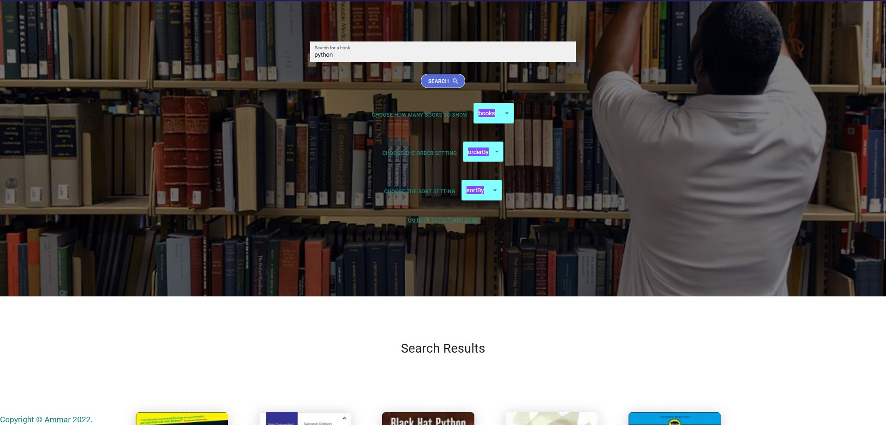

# Front-End Switch Task

## Author: Ammar Abul-Feilat

## overview

Creating a React app that displays a UI for searching books using Google Books API. Using `React` with `Nextjs` and `Material-UI`. Following the `Atomic Design` principles; The name Atomic Design comes from the idea of separating the components in atoms, molecules, organisms, templates and pages, Many components Have been made once but rendered multiple times by passing different props each time rendered in a page.

## Architecture

- ES6 ( ECMAScript 6)
- "react": "^18.0.0",
- "react-dom": "^18.0.0",
- "react-router-dom": "^6.3.0",
- NextJs : "^@latest"

- also check out Package.json file for more info.

## Run the Project

- clone the repo && change directory to the repo

- run `yarn install` or `npm install`

- open the browser and navigate to `http://localhost:3000` to change the port you can specify `yarn dev --port <port number>` or go to package.json change the port

- to run file `npm run dev` since im using NextJs

- also check it deployed on netlify by navigating to <https://radiant-pika-6af3d5.netlify.app/>

### Landing page

### Main Page

in Main page you can find your searched books and sort them based on author or title , also you get the option to click on a book and have a preview of it at `books.google.com` also you can sort by newest added books and choose how many books to show on each search.

all the drop lists(like: order By / sort By ) will dynamically change the results without you typing the query repeatedly.

 

## 404 Page Not Found

